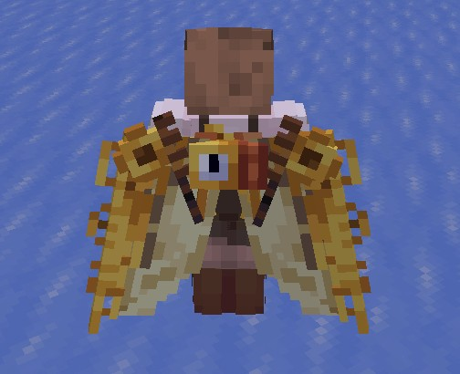

# The Observer
Language: [Language](Language/Language.md)

* Steampunk robot
* Steam powered
* Has jetpack (also steam powered)
	* In addition to the jetpack, also has wings that can unfold to continue gliding without using the amount of power the jetpack uses
		* the wings can fold and unfold, and so can each individual "feather"
		* think [murder drones wings](https://sketchfab.com/namwan0435/collections/n-murder-drones-fa03592bae06489990a212260a957eb9) but no curves on the individual "feathers" ([another link](https://web.archive.org/web/20241220015256/https://www.startpage.com/av/proxy-image?piurl=https%3A%2F%2Fi.kinja-img.com%2Fgawker-media%2Fimage%2Fupload%2Fc_fill%2Cfl_progressive%2Cg_center%2Ch_180%2Cq_80%2Cw_320%2Ff34c05e04491047f380954771969f0d7.jpg&sp=1734659043T8ffbd32211d8e9b89c083339e777f01ed21c4fe8396d6489795e8cf377a96dbb), I like this one better)
		* the wings should be small enough to neatly fold behind the back but big enough to look good
		* my terrible drawing skills (the wings should unfold like the jetpack+wings drawing):
		* reference 3 :O (They should be like this but with the "blades"/"feathers" in the above references. Just look at the actual wings not the attaching segment in the middle) (I did not make this, find the maker in the [FiguraMC Discord Server here](https://canary.discord.com/channels/1129805506354085959/1143474692812972083/1143474692812972083))  
* Brass
* Similar to [unicorn warrior copernicus](https://unicorn-warriors-eternal.fandom.com/wiki/Copernicus) but less fat and normal human height
* Archaic (Ancient isn't powerful enough)
* Existed for hundreds of thousands of years
* Relic from the very first humans humans
* It never turned off for those hundreds of years
* Knows most/almost all of human history
* It understands modern languages but can't communicate in them
* It can write, but it only knows the ancient language it speaks
	* The language looks like meaningless symbols to people who don't know it
		* The language is ideas represented by symbols linked together to form words, stories, etc. (check film theory's video on don't hug me I'm scared)
			* Ideograms that can link together
			* https://youtu.be/vwbQxMY7yds?t=335
* Neutral but likes being helpful when it can
* It shows emotion and has opinions, like a modern human
* Can't make any meaningful sounds other than steam hissing and it's steam whistle
* It doesn't use it's steam whistle very much
	* The steam whistle is in the mouth
* You can hear it's gears as it moves
* Doesn't have many exposed gears unless it is transforming in some way
* Its boiler is in its chest but not visible
	* Fuel and water goes in through the mouth

Name:
